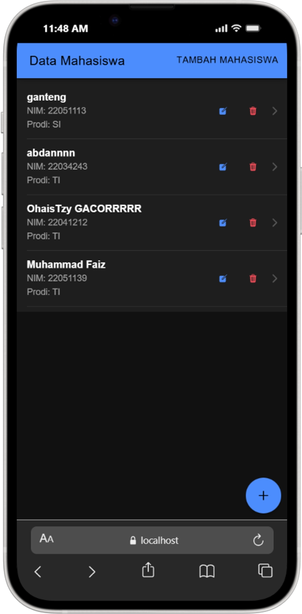

# Praktikum Ionic: CRUD Data Mahasiswa (Local Storage)

Repository ini adalah hasil pengerjaan **Tugas Pertemuan 7** mata kuliah Pemrograman Bergerak.
Aplikasi ini telah dikembangkan dengan fitur lengkap **CRUD (Create, Read, Update, Delete)** menggunakan penyimpanan lokal.

---

### 👨‍🎓 Identitas Mahasiswa
**Tugas ini dikerjakan dan dimodifikasi oleh:**

| Informasi | Detail |
| :--- | :--- |
| **Nama** | **Muhammad Faiz** |
| **NIM** | **220511139** |
| **Kelas** | **TI22D** |

---

## 📱 Preview Aplikasi

Berikut adalah dokumentasi fitur yang telah selesai dikerjakan:

| 1. Halaman Utama (Homepage) | 2. Fitur Edit (Update) | 3. Fitur Hapus (Delete) |
| :---: | :---: | :---: |
| <br>*(Menampilkan list data & NIM)* | <br>*(Modal Edit dengan Select Option)* | <br>*(Alert Konfirmasi Hapus)* |

*(Catatan: Screenshot tersimpan di folder `screenshots/`)*

---

## 🛠 Fitur yang Dikembangkan

1.  **Read (Menampilkan Data)**
    * Menampilkan daftar mahasiswa (Nama, NIM, Jurusan).
    * Data diambil dari `Capacitor Preferences` (Local Storage).
    * List reaktif menggunakan `ChangeDetectorRef`.

2.  **Create (Tambah Data)**
    * Form validasi menggunakan **Reactive Forms**.
    * Input Nama (Min 5 huruf), NIM (Angka), dan Jurusan.

3.  **Update (Edit Data) - *New Fitur***
    * Menggunakan **Modal Component** (`edit-modal`) dengan tampilan *Inset List*.
    * Form terisi otomatis (*pre-filled*) dengan data lama.
    * Validasi input tetap berjalan saat edit.
    * Input Jurusan menggunakan Dropdown (`ion-select`).

4.  **Delete (Hapus Data) - *New Fitur***
    * Tombol hapus dengan icon sampah (`trash`).
    * Dilengkapi **Alert Confirmation** ("Apakah Anda yakin?") untuk mencegah hapus tidak sengaja.
    * Menggunakan `stopPropagation()` agar klik tombol hapus tidak membuka detail mahasiswa.

---

## 🚀 Cara Install & Menjalankan

Jika Anda meng-clone repository ini, lakukan langkah berikut untuk menjalankannya:

1.  **Clone Repository**
    ```bash
    git clone [https://github.com/oci-cmd/ionic-save-data-local.git](https://github.com/oci-cmd/ionic-save-data-local.git)
    ```

2.  **Masuk ke Folder**
    ```bash
    cd ionic-save-data-local
    ```

3.  **Install Dependencies (Wajib)**
    Install ulang `node_modules` agar library terbaca.
    ```bash
    npm install
    ```

4.  **Jalankan Aplikasi**
    ```bash
    ionic serve
    ```

---

## 📦 Tech Stack
* **Framework**: Ionic Angular (Standalone Components)
* **Storage**: @capacitor/preferences
* **Icons**: Ionicons
* **Forms**: Angular Reactive Forms